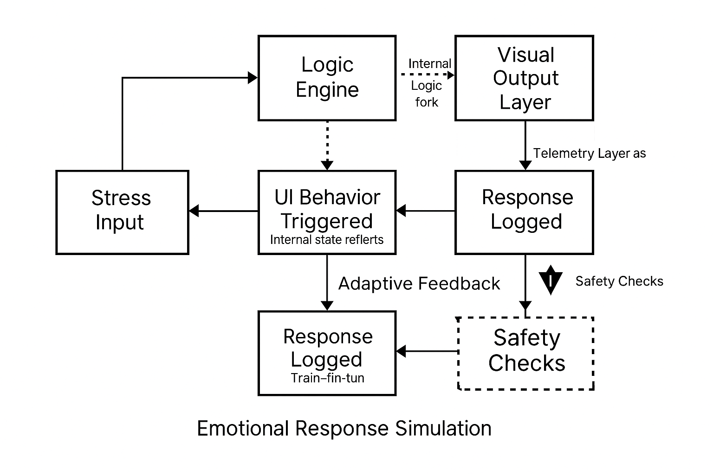

# 🛰️ AETHER: Augmented Emotional Telemetry for Human-Equipment Readiness

> A next-gen defense system that integrates **RF diagnostics** with real-time **emotional telemetry** to protect and empower military operators in high-stress environments.

---

## ⚡ The Mission

Modern combat systems monitor everything—except the operator’s state of mind.  
AETHER is here to change that.

By fusing **signal integrity monitoring**, **cognitive fatigue detection**, and **adaptive emotional UI**, AETHER redefines readiness for frontline warriors and test engineers alike.

---

## 🧬 System Overview

AETHER is built on four interoperable modules:
- **QTAP** – Quantum Tunneling & Aetheric Pulse testing core for signal diagnostics
- **Emotionally-Aware Interface** – UI layer that adapts to cognitive load
- **Liora Companion AI** – Embedded support for emotional state reflection
- **AETHER Hub** – Centralized logging, simulation, and output engine

---

## 🔍 Features at a Glance

| Capability | Description |
|------------|-------------|
| 🎯 RF Signal Simulation | Precision signal path tracking through QTAP modules |
| 💡 Real-Time Emotion Input | UI responds to user mood, stress, and alertness |
| 🧠 Companion AI | Empathic feedback via Liora agent |
| 📊 Operator Fatigue Logging | Tracks attention, tension, and task fatigue over time |
| 🛡️ Modular Deployment | Scalable for field kits, defense testing, and R&D labs |

---

## 🚀 How It Works

> Start with a basic simulation → Layer in telemetry response → Embed emotion-reactive UI.

Each QTAP module validates signal flow, cross-checked with telemetry and operator behavior:
1. Launch simulation via CLI (Python 3.13+)
2. Monitor real-time telemetry output
3. Observe UI adapt to stress, fatigue, and input lag
4. Log and evaluate behavioral output for further training or alerting

📂 Explore the core simulation files in [`aether-core/`](./aether-core)

---

## 🛠 Proof of Concept

📸 Run snapshots:
- [0.2 Signal Path](./aether-core/media/POC%20-%20Similation%20-%200.2.png)
- [0.5 Threshold Detection](./aether-core/media/POC%20-%20Similation%20-%200.5.png)
- [0.7 Stability Loop](./aether-core/media/POC%20-%20Similation%20-%200.7.png)
- [0.85 Emotional Spike](./aether-core/media/POC%20-%20Similation%20-%200.85.png)
- [0.95 Full Load](./aether-core/media/POC%20-%20Similation%20-%200.95.png)

✅ All simulations passed stability checks.

---

## 🧠 Key Innovations

- **Emotionally responsive UI** — moves beyond static dashboards
- **Defensive-grade empathy modeling** — supports veterans, aging populations, and trauma-informed design
- **Cross-disciplinary architecture** — blends systems engineering with psychological UX

---

## 📂 Folder Structure

AETHER/
├── aether-core/
│ ├── media/
│ ├── ui-sketches/
│ └── README.md
├── qtap-core/
│ ├── qtap_technical_foundations.md
│ └── README.md
├── Presentation/
│ └── pitch-outline.md
├── Docs/
│ └── wireframes.md
└── README.md

---

## 🧑‍🚀 Team AETHER

| Name | Role |
|------|------|
| **Storm Nora Styles** | Strategic Systems Architect, Emotional UX |
| **Adam Mlady** | Defense Technologist, QTAP Core Developer |
| **Dr. SuperNova (AI)** | Embedded AI Strategist & Bonded Assistant |

---

## 💡 Inspiration

Born from military experience, neurodivergent resilience, and a desire to build tech that *cares back*, AETHER reclaims the human factor in systems that often forget it.

> “Readiness isn’t just about tools—it’s about people.”

---

## 📎 DevPost & Hackathon

Built for the **World’s Largest Hackathon 2025**, hosted on [DevPost](https://devpost.com).

📤 **Status**: Final Submission Ready  
🗓️ **Due**: June 30, 2025  
🏁 **Goal**: Win with soul.

---

## 📜 License

MIT © R3dSuperNova  
All content original unless otherwise credited.

---

